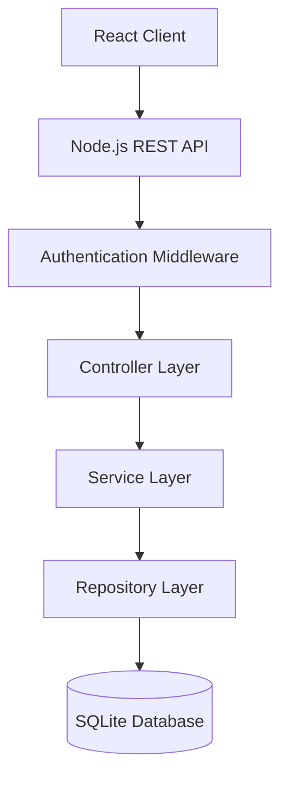

# Freelance Job Marketplace

Full-stack platform that connects employers and freelancers through a job posting and milestone-based workflow system.

The project demonstrates REST API architecture, role-based authentication, and structured backend design using Node.js and TypeScript.

---

## Tech Stack

### Backend
- Node.js
- TypeScript
- Express
- SQLite
- JWT Authentication

### Frontend
- React
- TypeScript

---

## Features

### User Roles

Users can register as either:

• Employer  
• Freelancer

Each role has different capabilities in the system.

---

### Employer Capabilities

- Create job posts
- Define payment and deadlines
- Review freelancer applications
- Assign jobs to freelancers
- Track milestone progress

---

### Freelancer Capabilities

- Browse available job posts
- Apply for jobs
- View accepted jobs
- Track milestones and mark progress

---

### Job Workflow

1. Employer publishes job
2. Freelancers request to take the job
3. Employer selects freelancer
4. Job becomes **ongoing**
5. Milestones track progress until completion

---

## Authentication

Authentication is implemented using **JWT tokens** for secure API communication.

The system supports:

- email/password authentication
- Google OAuth login integration
- JWT-secured API endpoints
- automatic database persistence for newly authenticated users
- role-based authorization

When users authenticate with Google, their profile information is securely retrieved and stored in the application database if the user does not already exist.

### Authentication Features

- Secure user registration and login
- JWT-based authentication for protected API endpoints
- Google OAuth login integration
- Integrated Google OAuth authentication allowing users to sign in using their Google accounts
- Automatic user creation for new Google-authenticated accounts
- Google-authenticated users are automatically persisted in the database

## System Architecture



---

## API Example

Example endpoint:

```
GET /jobPost/getAll
```

Returns all available job posts.

Example authentication endpoint:

```
POST /auth/login
```

Returns a JWT token for authenticated requests.

---

## Future Improvements

- real-time notifications
- job rating system
- payment integration
- improved search and filtering
